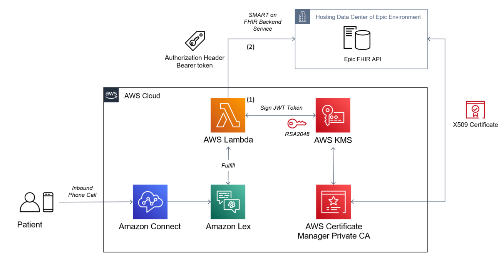

# Integrate Amazon Connect with SMART on FHIR backend Services

## SMART Backend Services Authorization

[SMART Backend services follow OAuth 2.0 framework](http://build.fhir.org/ig/HL7/bulk-data-export/authorization/index.html), which requires [Json Web Token (JWT)](https://jwt.io/) code-signing key and certificate generated by AWS Key Management Service (KMS) and AWS Certificate Manager (ACM) Private Certificate Authority (PCA) according to this [blog post](https://aws.amazon.com/blogs/security/code-signing-aws-certificate-manager-private-ca-aws-key-management-service-asymmetric-keys/).

The KMS-PCAACM-OAUTH folder is primarily derived from [previous sample code](https://github.com/aws-samples/diy-code-signing-kms-private-ca) for that blog post. The Runner.java main method was modified to serve this specific use case, and option is available to change AWS region to deploy the KMS Customer Master Key (CMK) and ACM PCA.

## Instructions

1. [Set up AWS credentials](https://docs.aws.amazon.com/sdk-for-java/v1/developer-guide/credentials.html). The credentials used should have permissions to invoke both ACM and ACM private CA API's. 

2. [Download and install Maven](https://maven.apache.org/download.cgi). At least JDK version 10 is needed for the code to execute successfully.

3. For executing the code, you can run this command in the directory where the git repo is cloned: `mvn verify` The *verify* phase has been declared in Maven POM file. You can also build and run program seperately. To build the Maven package, run the command in the cloned repo folder: `mvn clean package`; To run the program through maven: `mvn exec:java -Dexec.mainClass="com.amazonaws.acmpcakms.examples"`. 

Answer the questions asked for configuration (answers highlighted in bold below are inputs from you):
Please provide the private CA root common name:
**myappRoot**
Please provide the end entity common name:
**myapp**
Please provide the alias for KMS Customer Master Key:
**myappCMK**
Please select the AWS Region to deploy KMS Customer Master Key and Private CA:
[1] => us east 1
[2] => us east 2
[3] => us west 1
[4] => us west 2
[5] => eu west 1
[6] => eu west 2
[7] => eu west 3
[8] => eu north 1
[9] => eu central 1
[10] => ca central 1
**2**

After the program finished, you will see the code signing X509 certificate in stdout and in a file named *myappcodesigningcertificate.pem* in the same folder. You will need to upload this file to SMART backend service for oauth flow.

4. 

5. Update the KMS key policy to allow AWS Lambda function:  

Download the existing KMS key policy
`aws kms get-key-policy --policy-name default --key-id <KMS KEY ID> --output text`

Make updates:
`aws kms put-key-policy --policy-name default --key-id <KMS KEY ID> --policy file://kms_key_policy.json`

## Security

See [CONTRIBUTING](CONTRIBUTING.md#security-issue-notifications) for more information.

## License

This library is licensed under the MIT-0 License. See the LICENSE file.
